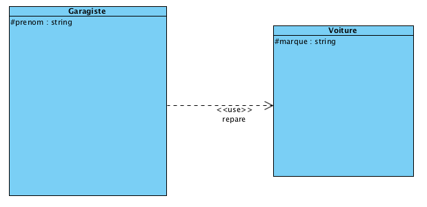
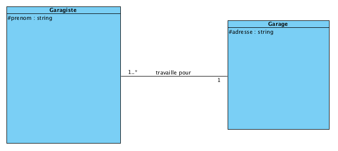
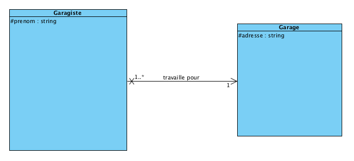

Modélisation
============

PHP Objet
---------

La programmation orienté objet s'inspire de la vie réelle. Les objets sont la représentation en mémoire d'un certains type d'objet (les classes). Exemple : un écran d'ordinateur est de type Ecran et il peut exister plusieurs objets Ecran.

La classe permet la création/construction de l'objet. C'est aussi sa famille/forme.

Une classe est un regroupement de variables et de fonctions qui intéragissent avec ces variables.

Dans un contexte objet :

 * on appelle les variables : **propriétés**, **attributs** ou **champs**
 * on appelle les fonction : **méthodes**

Pour éviter les conflits sur le nom des classes on les préfixe avec des namespaces.

Le namespace racine s'appelle vendor et doit être unique, par exemple le nom d'une société (Apple), le nom d'un projet (Symfony) ou le nom Github d'un développeur (Bioub).

Exemple de classe :

```php
<?php

namespace Prepavenir\Model\Entity;

class Contact
{
    protected $prenom;

    public function getPrenom()
    {
        return $this->prenom;
    }
    
    public function setPrenom($prenom)
    {
        $this->prenom = $prenom;
        return $this;
    }
}
```

Par convention les noms des classes et des namespaces commence par des majuscules.

Le nom complet d'une classe avec ses préfixes : Fully Qualified Class Name (FQCN ou FQN).

Par convention (PSR-4) aussi l'arborescence des sources correspond aux namespaces, ex:

* la classe `Utility\Array` -> `src/Utility/Array.php`
* la classe `Prepavenir\Model\Entity\Contact` -> `src\Entity\Contact.php`

Visibilité :

Un membre d'une classe (propriété ou méthode) peut être :

 * public : accessible de n'importe dès lors qu'on peut accéder à l'objet
 * protected : accessible depuis l'intérieur de la classe, les classes enfants ou parents
 * private : uniquement à l'intérieur de la classe

Principe d'encapsulation : les propriétés ne jamais publiques. Moins on en sait à propos du fonctionnement interne de la classe, plus elle est simple à utiliser.

Getters/Setters (Accesseurs), méthodes pour accéders aux propriétés, on peut limiter l'accès en ne créant pas le setter, et on peut masquer de la validation dans un setter.

### Référence

Les objets sont stockés en 2 parties :

* La variable contient la référence, c'est à dire où se trouve l'objet, affecter une variable signifie se donner un autre moyen d'accéder au même objet
* Les opérateurs new ou clone créent des nouveaux objets


### Types d'association

Les associations vont permettre aux objets de communiquer les uns avec les autres.

#### Utilisation

Association ponctuelle, une méthode d'un classe, va recevoir le temps de son appel une référence d'un autre objet.

```php
class Garagiste
{
    protected $prenom;
    
    public function reparer(Voiture $voiture)
    {
        return "Bonjour je m'appelle $this->prenom, je répare une voiture " . $voiture->getMarque();
    }
}
```

##### Utilisation en UML



#### Association

Association permanente, toute les méthodes d'une classe auront accès aux méthodes de l'autre classe.

```php
<?php

namespace Prepavenir\Model\Entity;

class Contact
{
    protected $prenom;

    /**
     * @var Societe
     */
    protected $societe; // reference vers un objet de type Societe

    public function getPrenom()
    {
        return $this->prenom;
    }

    public function setPrenom($prenom)
    {
        $this->prenom = $prenom;
        return $this;
    }

    public function getSociete()
    {
        return $this->societe;
    }

    public function setSociete(Societe $societe)
    {
        $this->societe = $societe;
        return $this;
    }
}
```

```php
<?php

namespace Prepavenir\Model\Entity;

class Societe
{
    protected $nom;

    /**
     * @var Contact[]
     */
    protected $contacts = [];

    public function getNom()
    {
        return $this->nom;
    }

    public function setNom($nom)
    {
        $this->nom = $nom;
        return $this;
    }

    public function getContacts()
    {
        return $this->contacts;
    }

    public function addContact(Contact $contact)
    {
        $this->contacts[] = $contact;
        return $this;
    }

}
```

##### Association en UML





L'association peut être bidirectionnelle, un objet sera lié à l'autre et inversement.
Utile si je dois réaliser des pages concernant une entité devant accéder à l'autre mais également les pages de l'autre entité.

Exemple : je veux une page contact qui affiche la société du contact, mais aussi une page société qui affiche les contacts de la société.

Si on a pas besoin de faire ces 2 types de page, laisser l'association unidirectionnelle (la flèche en UML).

Sur le diagramme on indique les cardinalités : ici un garagiste travaille pour 1 et 1 seul garage, un garage emploie 1 garagiste au minimum.

### Design Pattern

En architecture logicielle, un design pattern (patron de conception) est une réponse standard à un problème de conception, considérée comme étant un bonne pratique.

Exemple : MVC pour la séparation des responsabilité et l'évolutivité du code.

#### Design Pattern d'accès aux données

##### Table Data Gateway

Pour chaque table de la base de données, on créé une classe qui contient les méthodes permettant d'intéragir avec cette table.
Exemple : insert, update, find, findAll, findBySocieteId...

En PHP on peut réalisation son implémentation avec des tableaux associatifs, exemple :

```php
<?php

namespace Prepavenir\Model\Gateway;

class ContactGateway
{
    /**
     * @var \PDO
     */
    protected $pdo;

    public function __construct(\PDO $pdo)
    {
        $this->pdo = $pdo;
    }


    public function findAll()
    {
        $sql = "SELECT id, prenom, nom, email, telephone
                FROM contact
                LIMIT 100";

        $stmt = $this->pdo->query($sql);

        return $stmt->fetchAll(\PDO::FETCH_ASSOC);
    }

    public function insert(array $data)
    {
        $sql = "INSERT INTO contact (prenom, nom, email, telephone)
                VALUES(:prenom, :nom, :email, :telephone)";

        $stmt = $this->pdo->prepare($sql);

        return $stmt->execute($data);
    }
}
```

#### Injection de dépendance

Quand des objets dépendent les uns des autres, il faut éviter de faire les `new` à l'intérieur des classes.

Exemple de mauvaise pratique

```php
<?php

namespace Prepavenir\Model\Gateway;

class ContactGateway
{
    /**
     * @var \PDO
     */
    protected $pdo;

    public function __construct()
    {
        // ne pas faire
        $this->pdo = new \PDO('mysql:...', 'root', '');
    }
}
```

Dans cet exemple PDO est créé dans la classe ContactGateway et celà nous limite car on ne peut pas utiliser cette classe d'une autre manière dans un certains contexte :

* pour l'évolution : utiliser le driver mysqli plutot que PDO
* pour se servir de plusieurs connexions
* pour utiliser une version optimisée en production
* pour pouvoir écrire un test unitaire dans lequel on ne souhaite pas effectuer les requetes

Il vaut mieux injecter la dépendance c'est à dire recevoir via le constructeur ou un setter la référence de l'objet dont on dépend

```php
<?php

namespace Prepavenir\Model\Gateway;

class ContactGateway
{
    /**
     * @var \PDO
     */
    protected $pdo;

    public function __construct(\PDO $pdo)
    {
        $this->pdo = $pdo;
    }
}
```

Il y a un cas où on peut faire le new dans classe : si la classe représente une valeur (Entity, DateTime, ArrayCollection...)