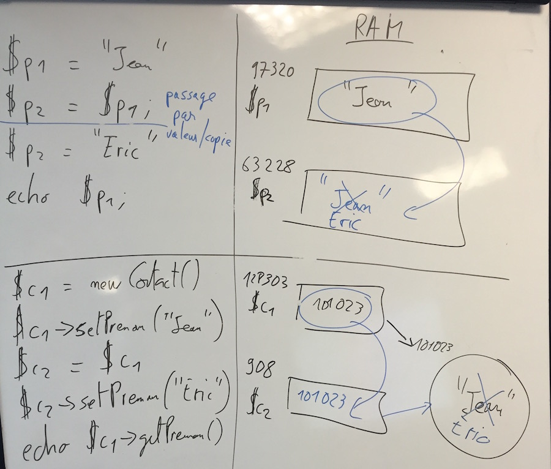

Modélisation
============

PHP Objet
---------

La programmation orienté objet s'inspire de la vie réelle. Les objets sont la représentation en mémoire d'un certains type d'objet (les classes). Exemple : un écran d'ordinateur est de type Ecran et il peut exister plusieurs objets Ecran.

La classe permet la création/construction de l'objet. C'est aussi sa famille/forme.

Une classe est un regroupement de variables et de fonctions qui intéragissent avec ces variables.

Dans un contexte objet :

 * on appelle les variables : **propriétés**, **attributs** ou **champs**
 * on appelle les fonction : **méthodes**

Pour éviter les conflits sur le nom des classes on les préfixe avec des namespaces.

Le namespace racine s'appelle vendor et doit être unique, par exemple le nom d'une société (Apple), le nom d'un projet (Symfony) ou le nom Github d'un développeur (Bioub).

Exemple de classe :

```php
<?php

namespace Prepavenir\Model\Entity;

class Contact
{
    protected $prenom;

    public function getPrenom()
    {
        return $this->prenom;
    }
    
    public function setPrenom($prenom)
    {
        $this->prenom = $prenom;
        return $this;
    }
}
```

Par convention les noms des classes et des namespaces commence par des majuscules.

Le nom complet d'une classe avec ses préfixes : Fully Qualified Class Name (FQCN ou FQN).

Par convention (PSR-4) aussi l'arborescence des sources correspond aux namespaces, ex:

* la classe `Utility\Array` -> `src/Utility/Array.php`
* la classe `Prepavenir\Model\Entity\Contact` -> `src\Entity\Contact.php`

Visibilité :

Un membre d'une classe (propriété ou méthode) peut être :

 * public : accessible de n'importe dès lors qu'on peut accéder à l'objet
 * protected : accessible depuis l'intérieur de la classe, les classes enfants ou parents
 * private : uniquement à l'intérieur de la classe

Principe d'encapsulation : les propriétés ne jamais publiques. Moins on en sait à propos du fonctionnement interne de la classe, plus elle est simple à utiliser.

Getters/Setters (Accesseurs), méthodes pour accéders aux propriétés, on peut limiter l'accès en ne créant pas le setter, et on peut masquer de la validation dans un setter.

### Référence

Les objets sont stockés en 2 parties :

* La variable contient la référence, c'est à dire où se trouve l'objet, affecter une variable signifie se donner un autre moyen d'accéder au même objet
* Les opérateurs new ou clone créent des nouveaux objets

